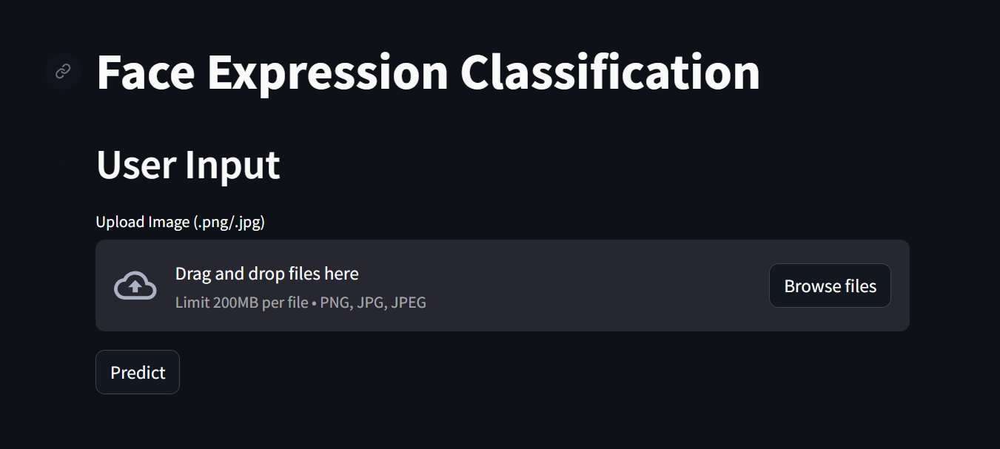
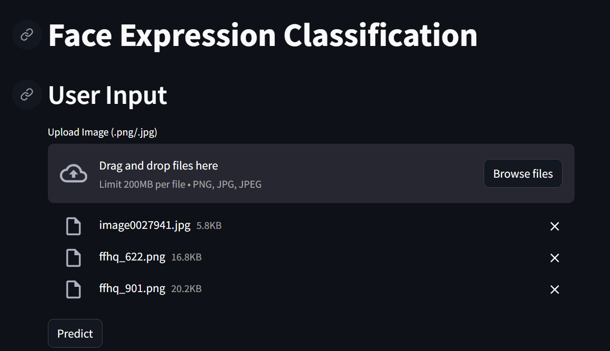
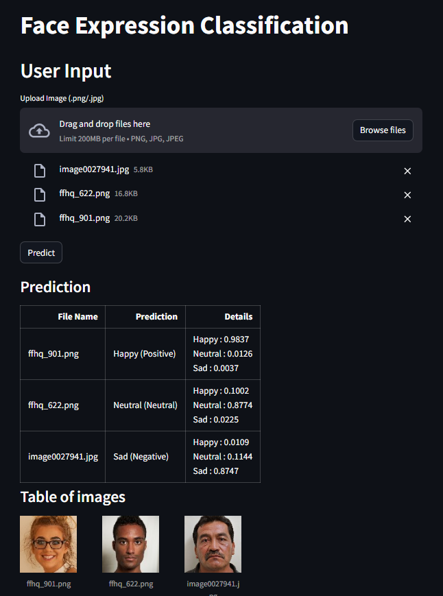

# **Face Expression Classification**

## About This Project

Human face expression image classification with Artificial Neural Network (ANN) and Gray Level Co-occurence Matrix (GLCM) as the feature extraction method.

## UI

1. Homepage
   
2. Add Image
   
3. Result
   

## References

- **Dataset Used in This Project**

  1. https://www.kaggle.com/datasets/noamsegal/affectnet-training-data
